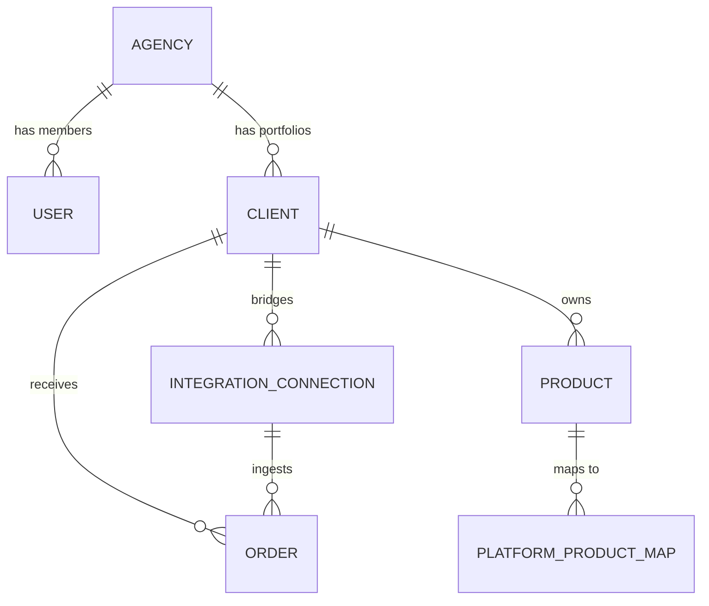

# NexusBridge Technical Architecture

Welcome to the technical core of **NexusBridge**, a multi-tenant enterprise commerce orchestration platform.

## 1. Multitenancy Strategy

NexusBridge uses a **Single Database, Shared Schema** multitenancy model. Data isolation is achieved through a hierarchical scoping system.

### Hierarchy
1.  **Agency (Tenant)**: The top-level entity. Every standard user belongs to exactly one agency.
2.  **Portfolio (Client)**: Agencies manage multiple commerce portfolios.
3.  **Resources**: Products, Orders, and Integrations are scoped to both an Agency and a Client.

### Data Isolation Mechanism
All models contain an `agency_id` foreign key. Scoping is currently handled at the Controller/Repository layer:
- **Filtering**: Queries are prefixed with `->where('agency_id', Auth::user()->agency_id)`.
- **Validation**: Incoming requests check that the target `client_id` belongs to the authenticated user's `agency_id`.
- **Superadmin Bypass**: Users with the `superadmin` role have a null `agency_id` and can bypass all scopes to manage the entire SaaS ecosystem.

## 2. Platform Roles (RBAC)

The system utilizes Laravel Gates and Policies to enforce three levels of authority:

| Role | Scope | Key Capabilities |
| :--- | :--- | :--- |
| **Superadmin** | Global | Provision Agencies, Monitor system health, Access all data. |
| **Agency Admin** | Agency | Manage team members, Configure marketplace integrations. |
| **Agent** | Agency | View catalog, Monitor live orders, Portfolio management. |

## 3. Data Model

## 4. Frontend Architecture

- **Engine**: Tailwind CSS (JIT) + Vanilla JS + Alpine.js.
- **Theme System**: Class-based `darkMode` with `localStorage` persistence.
- **Components**: Reusable Blade components (`x-filter-sort-bar`, `x-sortable-th`) for consistent UI patterns.
- **Aesthetic**: Custom "Outfit" typography bundle with glassmorphism components and a zero-gap sidebar hover state.

